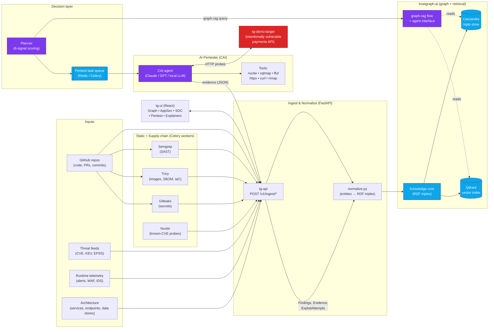
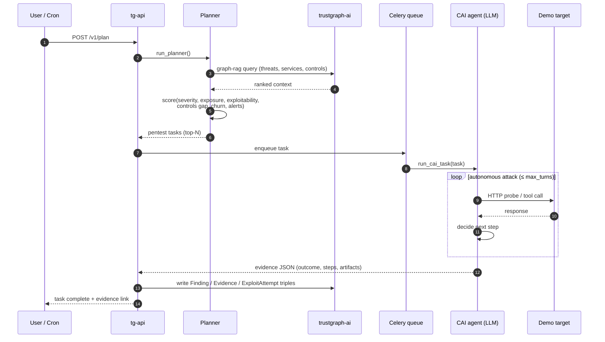
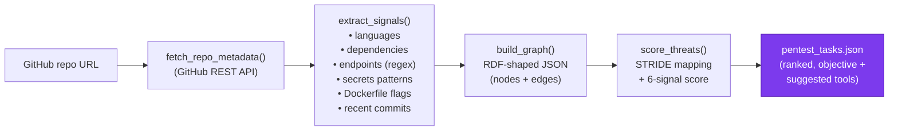

# TrustGraph Security — Architecture

## High-level data flow



## The AI loop (zoom-in)



## GitHub-repo → graph → pentest-tasks prototype

The standalone prototype in `prototype/` shows the **core idea in 200 lines** without needing Docker, Cassandra, or an LLM key.



Run it:

```bash
cd prototype
pip install httpx
python repo_to_tasks.py https://github.com/OWASP/NodeGoat
# → writes graph.json + tasks.json next to the script
```
