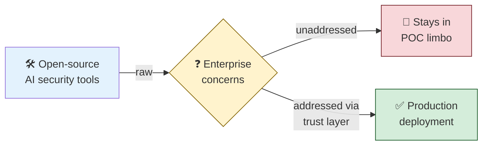
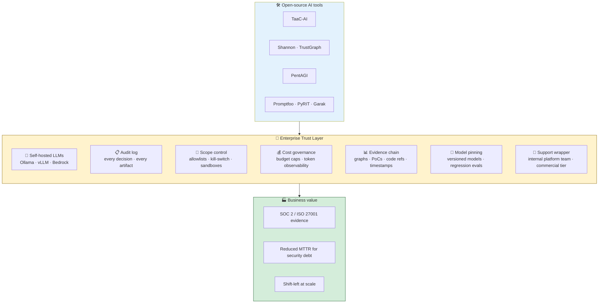

# Enterprise Trust Layer — Adopting AI Security Tools at Scale

> **Purpose:** Most AI pentesting tools are open source. Devs love that; CISOs don't trust it. This doc explains the gap and how to close it.
>
> **Audience:** Security architects, CISOs, platform engineers, and dev leads evaluating AI security tooling for enterprise adoption.

---

## The trust gap, in one diagram



Tools like TaaC-AI, Shannon, PentAGI, Promptfoo are powerful but raw. Enterprises need a **wrapper layer** — controls, audit, scope, SLAs — before they'll allow these tools near production.

---

## The seven enterprise concerns

| # | Concern | Why it matters | Mitigation pattern |
|---|---|---|---|
| 1 | **Code / data leaves perimeter** | Source code, customer data, or secrets sent to a third-party LLM = compliance breach | Self-hosted LLMs (Ollama, vLLM, Bedrock private endpoints), BYO-key with audit logs, on-prem deployment |
| 2 | **No SLA / no vendor liability** | OSS projects have no support contract, no security commitments, no roadmap guarantees | Wrap OSS with internal platform team; pay for commercial tier where it exists (Shannon Pro, XBOW, Mindgard, Aikido) |
| 3 | **Compliance evidence chain** | SOC 2, PCI-DSS, ISO 27001 require reproducible artifacts | Tools must emit graphs, PoCs, code references, timestamps as immutable evidence |
| 4 | **Auditability of AI decisions** | "The LLM said so" is not a defensible audit answer | Prefer tools with inspectable ranking (graph + signals + scoring formula) over black-box LLM judgment |
| 5 | **Scope / blast-radius control** | Autonomous pentesters can attack the wrong system or escalate beyond scope | Sandboxed runners, allowlisted targets, kill-switches, rate limits, dry-run modes |
| 6 | **Model drift** | LLM provider updates change tool behavior unpredictably | Pin model versions, run regression eval suites, baseline against known PoCs |
| 7 | **Cost predictability** | Per-token pricing × autonomous agents = surprise bills | Budget caps per scan, local LLMs for high-volume scans, observability on token spend |

---

## The trust layer architecture



---

## Where each tool stands today

### Stage 1 — Design tools

| Tool | Self-host LLM? | Audit log | Compliance templates | Enterprise tier |
|---|:---:|:---:|:---:|:---:|
| TaaC-AI | ✅ via Ollama | ⚠️ via wrapper | ⚠️ STRIDE/OWASP only | ❌ |
| IriusRisk | ⚠️ commercial | ✅ | ✅ PCI/ISO/NIST | ✅ |

### Stage 2 — Code tools

| Tool | Self-host LLM? | Audit log | Compliance templates | Enterprise tier |
|---|:---:|:---:|:---:|:---:|
| Shannon Lite | ✅ | ⚠️ basic | ❌ | Shannon Pro |
| TrustGraph-Security | ✅ via Ollama | ✅ graph triples | ⚠️ STRIDE/MITRE | (this hackathon) |
| Aikido | ⚠️ commercial | ✅ | ✅ SOC 2, ISO | ✅ |

### Stage 3 — Runtime tools

| Tool | Self-host LLM? | Audit log | Scope control | Enterprise tier |
|---|:---:|:---:|:---:|:---:|
| PentAGI | ✅ Ollama | ✅ | ✅ sandboxed | ❌ |
| PentestGPT | ❌ OpenAI only | ⚠️ basic | ⚠️ | ❌ |
| XBOW | ⚠️ commercial | ✅ | ✅ | ✅ |
| NodeZero | ⚠️ commercial | ✅ | ✅ | ✅ |

### Stage 4 — LLM-app tools

| Tool | Self-host LLM? | Audit log | Compliance mapping | Enterprise tier |
|---|:---:|:---:|:---:|:---:|
| Promptfoo | ✅ | ✅ | ✅ OWASP, MITRE ATLAS, EU AI Act | ✅ paid tier |
| PyRIT | ✅ | ✅ | ✅ via Azure AI Foundry | ✅ Azure |
| Garak | ✅ | ✅ | ⚠️ AVID | ❌ |

---

## Adoption playbook

```mermaid
flowchart LR
    A[1·Inventory<br/>your SDLC] --> B[2·Pick one tool<br/>per stage]
    B --> C[3·Run in sandbox<br/>against test target]
    C --> D[4·Build trust layer<br/>(self-host LLM · audit · scope)]
    D --> E[5·Pilot on<br/>one team/repo]
    E --> F[6·Define evidence<br/>schema for audit]
    F --> G[7·Roll out<br/>org-wide]

    style A fill:#e3f2fd
    style D fill:#fff3cd
    style G fill:#d4edda,stroke:#155724
```

### Step-by-step

1. **Inventory your SDLC** — Which stages are you most exposed on? Most enterprises start with Stage 2 (code) or Stage 4 (LLM-app) because those have the clearest business owners.
2. **Pick one tool per stage** — Don't try to adopt all four stages at once. Get one stage to production-grade, then expand.
3. **Run in sandbox** — Against a known test target (e.g., OWASP Juice Shop, DVWA, intentionally vulnerable repo). Establish a baseline.
4. **Build the trust layer** — Self-host the LLM, wire up audit logs, define scope allowlists, set budget caps.
5. **Pilot on one team or repo** — Pick a friendly team. Measure: false-positive rate, time-to-fix, audit evidence completeness.
6. **Define evidence schema** — What does each finding need to ship with? (Graph node, code ref, PoC artifact, scanner version, model version, timestamp.) This is your audit defensibility.
7. **Roll out org-wide** — Only after steps 1–6 are repeatable.

---

## The TrustGraph hackathon angle

TrustGraph-Security is built to demonstrate this trust layer end-to-end:

- **Self-hostable LLMs** — Works with Ollama, OpenAI, or Anthropic via env vars
- **Graph-based audit** — Every finding lives as RDF triples in TrustGraph core; full lineage from threat → control → scanner → evidence
- **Inspectable scoring** — The 6-signal scorer is a transparent formula, not "the LLM decided"
- **Scope control** — Sandboxed Juice Shop target; CAI agents can't escape the docker network
- **Evidence chain** — Every CAI run produces an `Evidence` triple linked via `evidenced_by` back to the originating threat node

That's not because TrustGraph is special — it's because **any enterprise-ready AI security tool needs these properties**. The hackathon is the smallest reasonable demonstration of the pattern.

---

## Related reading

- [PRIMER.md](./PRIMER.md) — 15-min intro to threat modeling and AI pentesting
- [LANDSCAPE.md](./LANDSCAPE.md) — Tools available at each SDLC stage
- [ARCHITECTURE.md](./ARCHITECTURE.md) — How TrustGraph implements this trust layer
- [OWASP Top 10 for LLMs](https://owasp.org/www-project-top-10-for-large-language-model-applications/)
- [NIST AI Risk Management Framework](https://www.nist.gov/itl/ai-risk-management-framework)
- [MITRE ATLAS — Adversarial Threat Landscape for AI Systems](https://atlas.mitre.org/)
