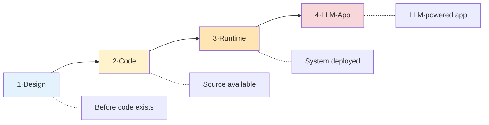
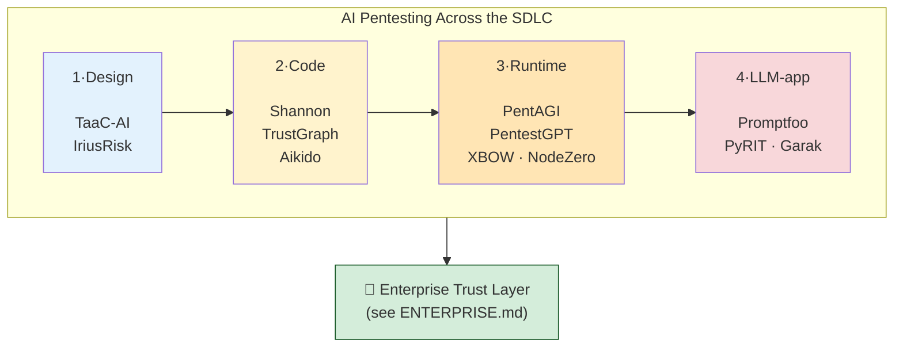

# AI Pentesting Landscape — Tools Across the SDLC

> **Purpose:** A neutral map of open-source AI security tooling, organized by where it fits in the software lifecycle. Use this to pick the right tool for the stage you're in — not to pick a winner.
>
> **Audience:** Developers, security engineers, and enterprise architects evaluating where AI fits in their security program.

---

## The four stages

Each stage answers a different question, has different inputs, and has different open-source tools maturing around it.

---

## Stage 1 — Design (shift-left threat modeling)

**The question**: *Can we find threats before code is written?*

**Inputs**: Service descriptions, architecture diagrams, data-flow YAML.
**Outputs**: STRIDE / OWASP / MITRE-mapped threat reports.

| Tool | License | What it does |
|---|---|---|
| [TaaC-AI](https://github.com/yevh/TaaC-AI) | Open source | YAML service description → GPT-4 / Claude / Mistral via Ollama → STRIDE + OWASP HTML report, cross-validated across LLMs |
| [IriusRisk](https://www.iriusrisk.com/) | Commercial | AI-assisted threat modeling, regulatory templates (PCI-DSS, ISO 27001) |
| [ThreatModeler](https://threatmodeler.com/) | Commercial | Drag-drop diagram → automated threat list + mitigations |

**Patterns devs learn**: Threat-modeling-as-code, LLM-assisted STRIDE/OWASP analysis, design-time risk scoring.

**Honest limits**: These tools model the *description*, not real code. If your YAML is stale or wrong, the threat model is wrong. They also don't execute attacks — pure design-time analysis.

---

## Stage 2 — Code (whitebox autonomous)

**The question**: *Can AI read a repo and tell us what to fix first?*

**Inputs**: Source code (full repo).
**Outputs**: Ranked attack-surface tasks with code references; validated PoCs.

| Tool | License | What it does |
|---|---|---|
| [Shannon (Keygraph)](https://github.com/KeygraphHQ/shannon) | MIT (Lite) / Commercial (Pro) | Reads source → identifies attack vectors → executes real exploits → only reports validated PoCs |
| **TrustGraph-Security** (this repo) | Apache-2.0 | Reads repo → builds attack-surface graph → 6-signal scorer ranks tasks → CAI executes attacks → findings link to code lines |
| [Aikido](https://www.aikido.dev/) | Commercial | SAST + SCA + secrets + IaC + DAST + AI-driven autonomous pentest in one platform |

**Patterns devs learn**: Graph-based attack-surface modeling, evidence-backed prioritization, whitebox-to-blackbox correlation.

**Honest limits**: Requires source access — IP exposure to LLMs is a real concern for proprietary code. False-positive rates still vary widely.

---

## Stage 3 — Runtime (black-box autonomous)

**The question**: *Can AI attack a live system autonomously?*

**Inputs**: A target URL, IP range, or scope description.
**Outputs**: Vulnerability reports with PoCs from real exploits.

| Tool | License | What it does |
|---|---|---|
| [PentAGI](https://github.com/vxcontrol/pentagi) | Open source | 13+ agents (Orchestrator, Pentester, Coder, Reflector, Enricher…) run nmap, Metasploit, sqlmap in Docker sandboxes; chain-summarization for 200K-token context |
| [PentestGPT](https://github.com/GreyDGL/PentestGPT) | Open source | Mature (3+ years), ~90% solve rate on Hack The Box; pentest copilot that issues tool commands |
| [redamon](https://github.com/samugit83/redamon) | Open source | Newer agentic red-team framework |
| [XBOW](https://xbow.com/) | Commercial | Aggressive autonomous agents, evolving payloads, PoC reporting |
| [NodeZero (Horizon3.ai)](https://www.horizon3.ai/) | Commercial | Autonomous internal/external pentest platform |
| [Mindgard](https://mindgard.ai/) | Commercial | Full-lifecycle AI security platform |

**Patterns devs learn**: Multi-agent orchestration, sandboxed exploit execution, autonomous attack-chain construction.

**Honest limits**: Black-box only — finds the bug but not the *line of code* that caused it. Heavy stacks (multiple containers, vector DBs, LLM keys). Scope control and blast-radius management are non-trivial.

---

## Stage 4 — LLM-app testing (the new attack surface)

**The question**: *What if your app **is** an AI? How do you test for jailbreaks and prompt injection?*

**Inputs**: An LLM-based application or API.
**Outputs**: Behavioral reports against OWASP LLM Top 10, MITRE ATLAS, NIST AI RMF.

| Tool | License | What it does |
|---|---|---|
| [Promptfoo](https://www.promptfoo.dev/) | Open source | Dev-first red teaming + evals, OWASP/MITRE ATLAS/EU AI Act compliance mapping, MCP testing |
| [PyRIT (Microsoft)](https://github.com/Azure/PyRIT) | Open source | Adversarial AI campaigns; now integrated into Azure AI Foundry as the Red Teaming Agent |
| [Garak (NVIDIA)](https://github.com/NVIDIA/garak) | Open source | ~100 attack vectors, ~20,000 prompts per run, AVID integration |
| [FuzzyAI (CyberArk)](https://github.com/cyberark/FuzzyAI) | Open source | Jailbreak fuzzing via mutation/generation |
| [AIRTBench (Dreadnode)](https://github.com/dreadnode/AIRTBench-Code) | Open source | Autonomous red-team agent benchmark for AI/ML CTF challenges |
| [Vectara red-teaming-agent](https://github.com/vectara/red-teaming-agent) | Open source | Google ADK-based, tests agent systems |

**Patterns devs learn**: Adversarial prompt construction, behavioral evals, jailbreak detection, multi-turn red teaming, AI compliance mapping.

**Honest limits**: Models change frequently — tests need continuous re-runs. Doesn't test the surrounding infra, just the LLM behavior layer.

---

## How the stages compose

A mature security program uses tools from **multiple stages**, not one. A design tool catches what runtime tools can't (architectural flaws). A runtime tool catches what design tools can't (exploit-chainable bugs). A whitebox tool tells you where to fix; a blackbox tool proves it's broken.

---

## Picking a tool for your situation

| If you have… | …start with this stage | Example tools |
|---|---|---|
| A feature spec, no code yet | Stage 1 — Design | TaaC-AI |
| A repo you're triaging for security debt | Stage 2 — Code | Shannon, TrustGraph |
| A deployed system, no source access | Stage 3 — Runtime | PentAGI, PentestGPT |
| An LLM-powered chatbot or agent | Stage 4 — LLM-app | Promptfoo, PyRIT, Garak |
| All of the above (real enterprise) | All four, orchestrated | See [ENTERPRISE.md](./ENTERPRISE.md) |

---

## Related reading

- [PRIMER.md](./PRIMER.md) — 15-minute intro to threat modeling, STRIDE, MITRE
- [ENTERPRISE.md](./ENTERPRISE.md) — How enterprises adopt open-source AI security tools
- [Promptfoo's open-source roundup (2025)](https://www.promptfoo.dev/blog/top-5-open-source-ai-red-teaming-tools-2025/)
- [Mindgard's AI pentesting tools comparison (2026)](https://mindgard.ai/blog/top-ai-pentesting-tools)
- [Comp AI penetration testing guide (2025)](https://www.trycomp.ai/hub/best-penetration-testing-tools)
