# Hackathon Primer — AI Pentesting Across the SDLC

> **Audience:** Developers learning how AI is changing security testing.
> **Goal:** By the end of this doc you'll know how AI pentesting flows from **design → code → runtime → LLM apps**, what open-source tools exist at each stage, and what enterprises need before they trust any of it.
>
> **TrustGraph-Security is one tool in this story** — the whitebox/runtime example we'll run in the hackathon. The patterns transfer to every other tool in the field.
>
> **Time:** ~15 min skim. Then we run the demo.

---

## Part 1 — Threat Modeling in One Picture

**Threat modeling** = sitting down *before* you ship and asking "if I were a bad guy, how would I break this?"

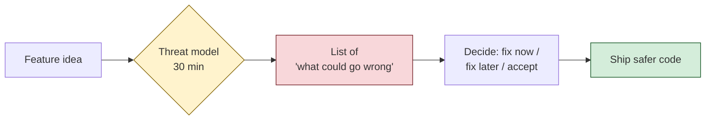

It's a **code review for abuse**, not for cleanliness.

### A real threat model is just a small table

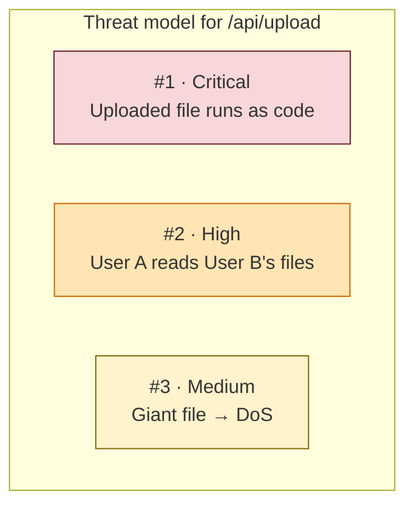

You don't have to *fix* everything — you have to **know it exists** so you can decide.

### Why devs skip it

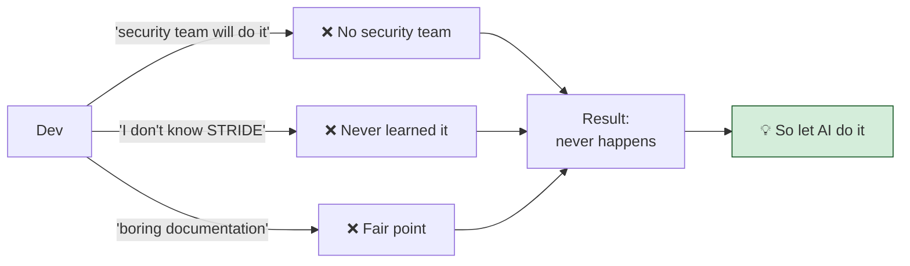

---

## Part 2 — STRIDE in One Diagram

STRIDE = **6 categories of things that can go wrong.** Memorize the letters, cover 80% of real bugs.

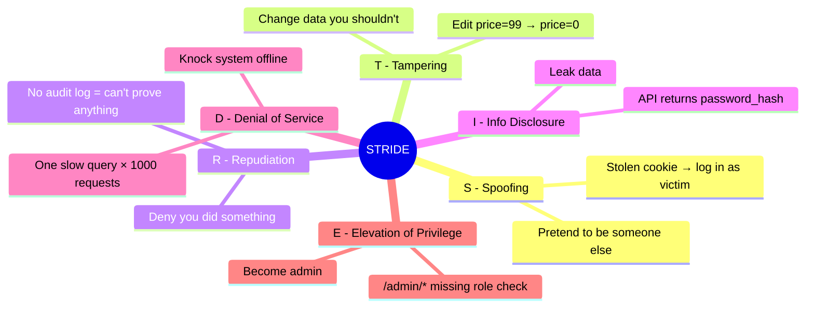

### How to use STRIDE in 30 seconds

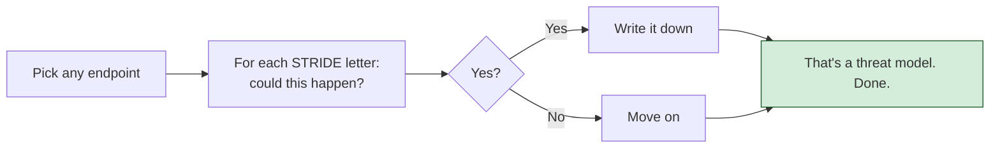

---

## Part 3 — MITRE ATT&CK: The Attacker's Playbook

If STRIDE is "what *categories* of bug exist," MITRE ATT&CK is **"what real attackers actually do, in order."**

Attackers don't find one bug and win — they **chain bugs**. MITRE catalogues every step.

```mermaid
flowchart LR
    A[Recon] --> B[Initial<br/>Access]
    B --> C[Execution]
    C --> D[Persistence]
    D --> E[Privilege<br/>Escalation]
    E --> F[Defense<br/>Evasion]
    F --> G[Credential<br/>Access]
    G --> H[Discovery]
    H --> I[Lateral<br/>Movement]
    I --> J[Collection]
    J --> K[Exfiltration]
    K --> L[Impact]

    style A fill:#e3f2fd
    style B fill:#bbdefb
    style E fill:#ffcdd2
    style I fill:#ffcdd2
    style K fill:#f8d7da,stroke:#721c24
    style L fill:#f8d7da,stroke:#721c24
```

### A real attack chain

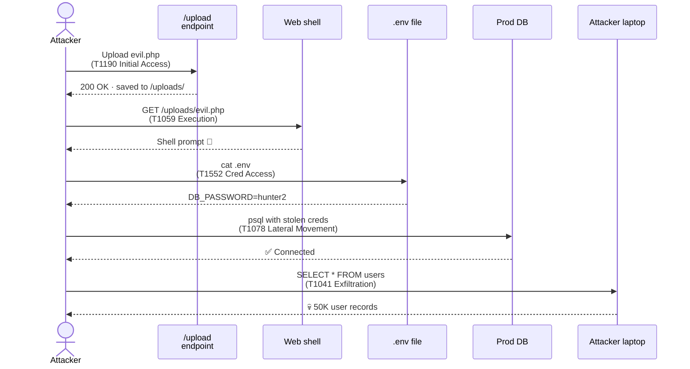

You don't memorize T-numbers. You internalize: **real attacks are graphs, not single bugs.**

### STRIDE vs MITRE — one picture

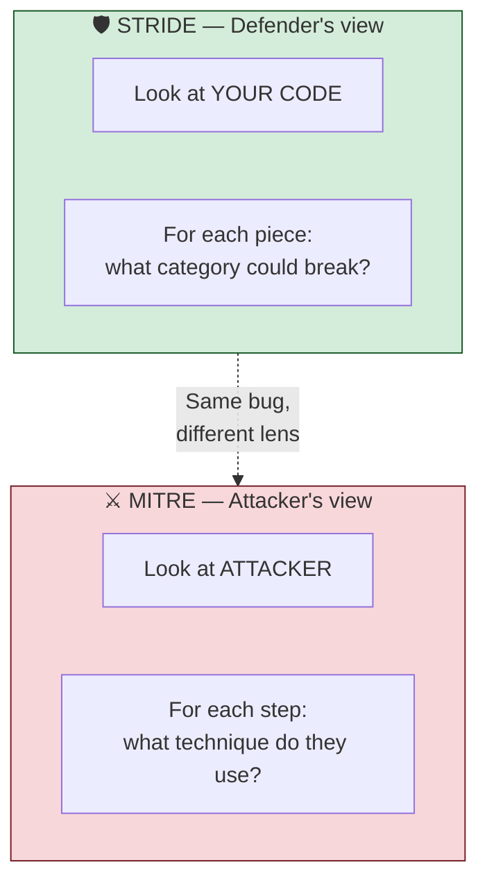

---

## Part 4 — How a Pentest Actually Works

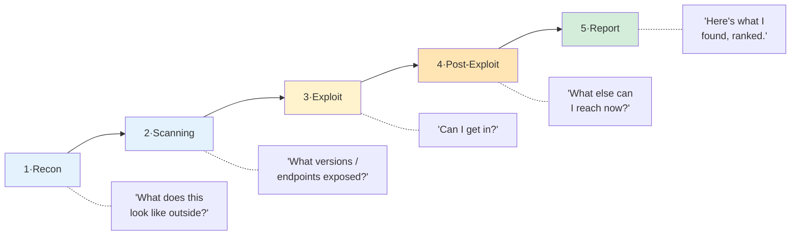

### Where the value actually is

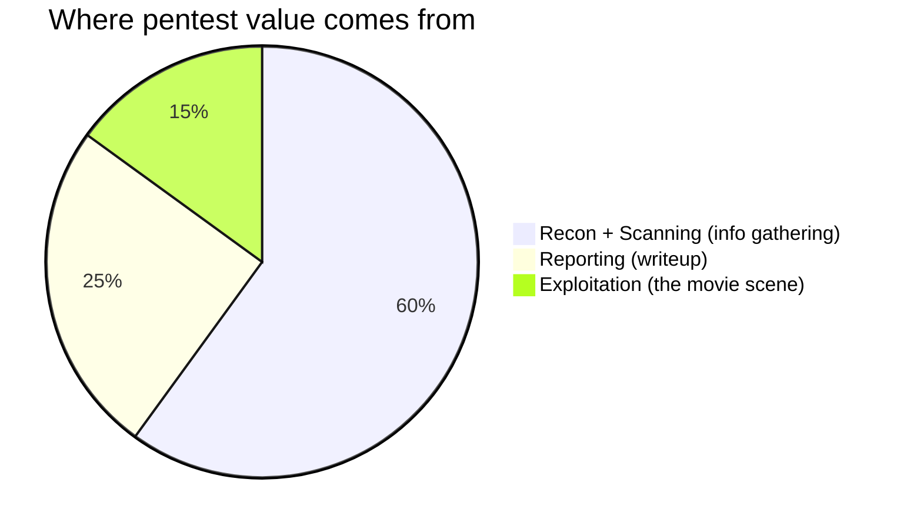

**90% of the work is information gathering + writeup.** That's exactly what LLMs are good at — which is why AI pentest tools exist.

---

## Part 5 — AI Pentesting Across the SDLC

AI is showing up at every stage of the software lifecycle. Each stage has its own open-source tools, its own strengths, and its own enterprise-trust questions.

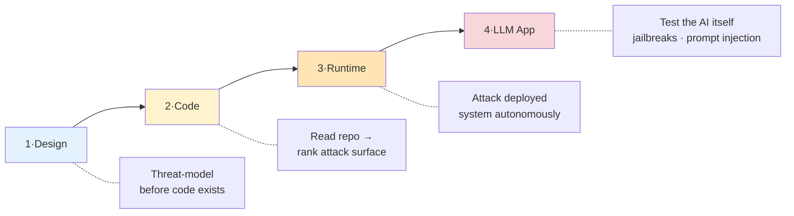

> **For full per-tool detail, see [LANDSCAPE.md](./LANDSCAPE.md). For the enterprise trust matrix, see [ENTERPRISE.md](./ENTERPRISE.md).**

### Stage 1 — Design (shift-left threat modeling)

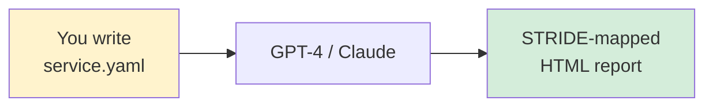

- **Tool**: [TaaC-AI](https://github.com/yevh/TaaC-AI) — Threat-modeling-as-code via LLMs
- **Strength**: Catches threats before a line is written. Cheap, fast, language-agnostic.
- **Trust gap**: Models the YAML, not reality. Stale description = stale threat model.

### Stage 2 — Code (whitebox autonomous)

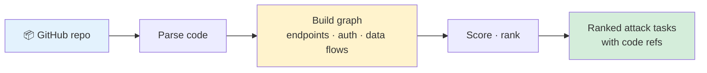

- **Tools**: [Shannon by Keygraph](https://github.com/KeygraphHQ/shannon), **TrustGraph-Security** (this repo)
- **Strength**: Findings link back to file + line. Devs know what to fix.
- **Trust gap**: Source code leaves perimeter unless self-hosted LLM is used.

### Stage 3 — Runtime (black-box autonomous)

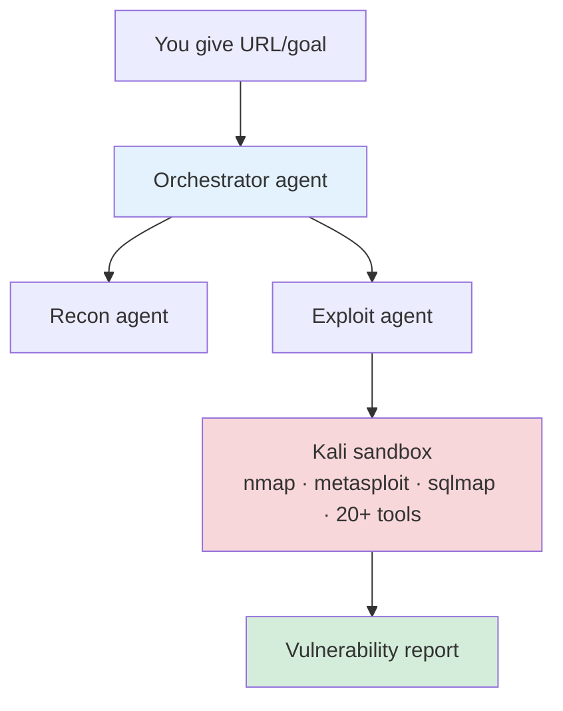

- **Tools**: [PentAGI](https://github.com/vxcontrol/pentagi), [PentestGPT](https://github.com/GreyDGL/PentestGPT), XBOW (commercial)
- **Strength**: Real exploits, real PoCs, mature toolchains.
- **Trust gap**: No code awareness — finds bugs but not the root cause line.

### Stage 4 — LLM-app testing (the new attack surface)

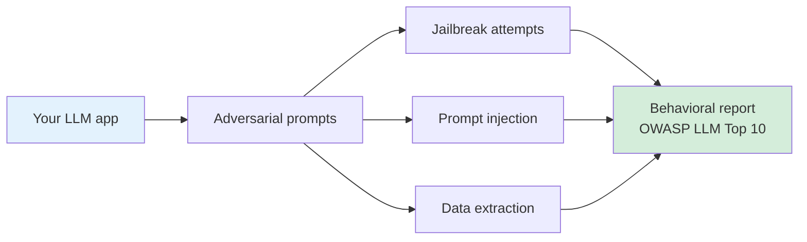

- **Tools**: [Promptfoo](https://www.promptfoo.dev/), [PyRIT (Microsoft)](https://github.com/Azure/PyRIT), [Garak (NVIDIA)](https://github.com/NVIDIA/garak)
- **Strength**: Tests behavior an LLM-based app exhibits, not its hosting infra.
- **Trust gap**: Models change; tests need continuous re-runs to stay valid.

### The lifecycle in one diagram

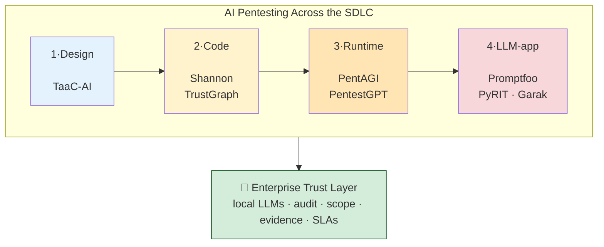

Most of these are open source. **No enterprise will plug them in raw** — that's the gap [ENTERPRISE.md](./ENTERPRISE.md) addresses.

---

## Part 6 — TrustGraph-Security as the Hands-On Example

We picked the **whitebox/code stage** for the hackathon because it's where most devs spend their time — and where a graph + ranked tasks teaches the most transferable patterns.

> **"Point me at a GitHub repo. I'll read the code, build a security knowledge graph, rank the realistic attack paths, and run a live pentest against a deployed copy."**

### The pipeline

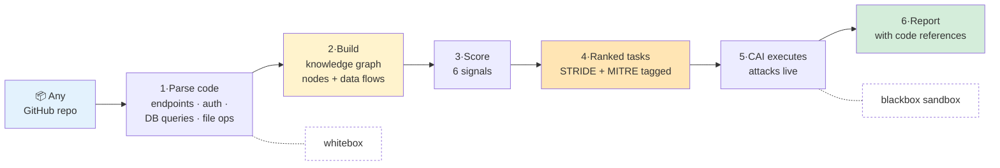

### Whitebox + blackbox in the same loop

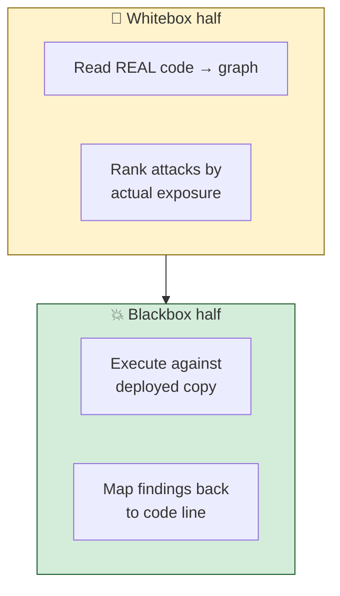

Most tools do one half. The hackathon lets you watch both halves run end-to-end on a repo you choose.

### The 6-signal scorer

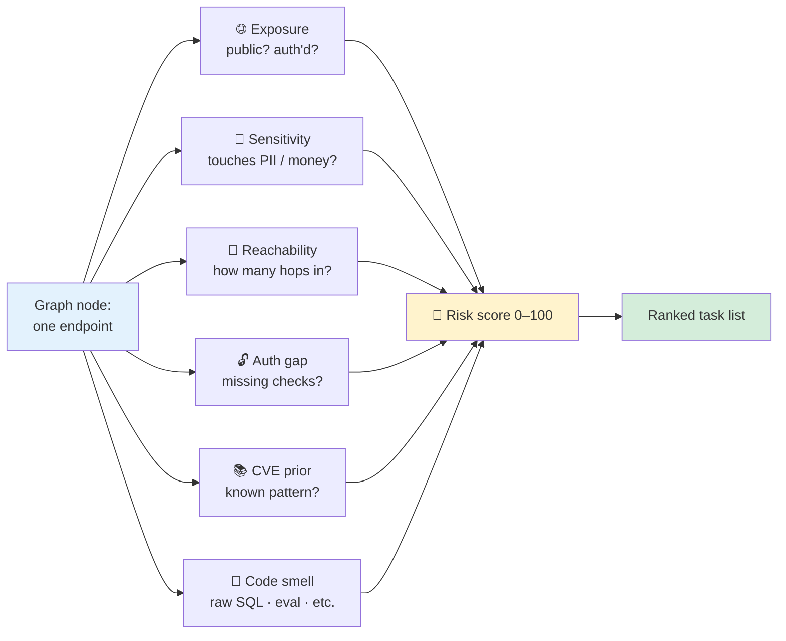

---

## Part 7 — What Happens Next

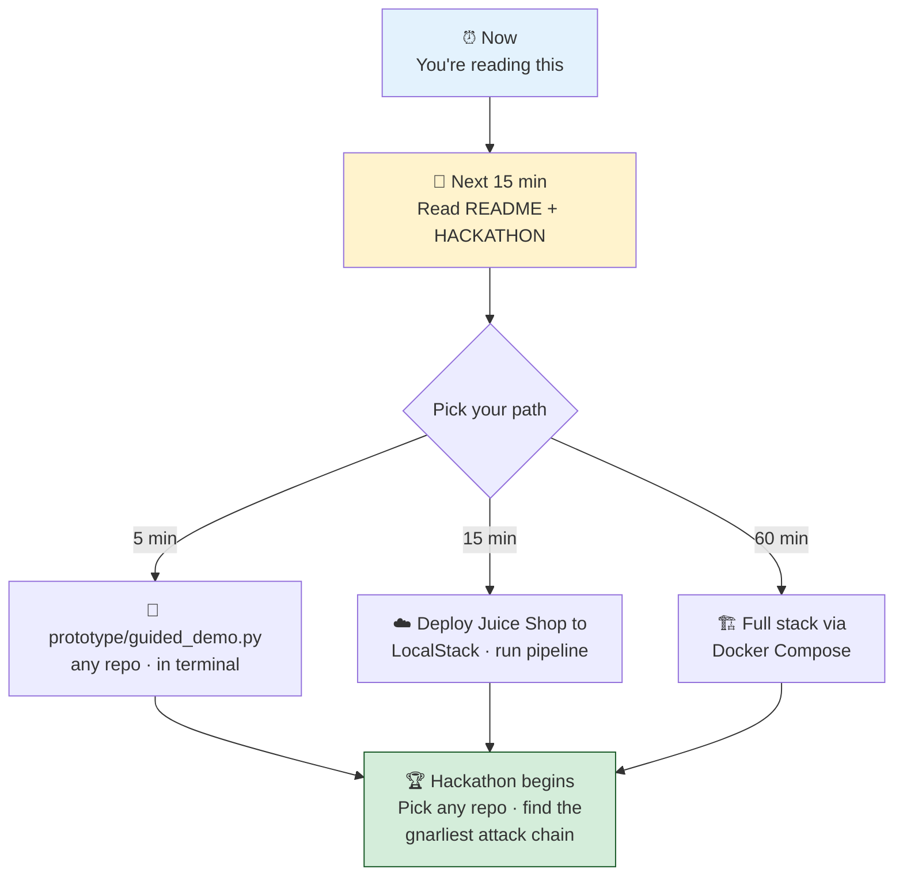

The graph and the tasks belong to you. The leaderboard is whoever finds the nastiest attack chain.

Welcome. Now read the rest of the room.

---

### Quick reference

- 🗺️ [Architecture diagram](./ARCHITECTURE.md)
- 📖 [Security concepts glossary](./CONCEPTS.md)
- 🌍 [AI pentest landscape — tools per SDLC stage](./LANDSCAPE.md)
- 🏢 [Enterprise trust matrix](./ENTERPRISE.md)
- 🚀 [5 / 15 / 60-min paths](./HACKATHON.md)
- 🎬 [Presenter walkthrough](./WALKTHROUGH.md)
- 🚢 [Full deployment](./DEPLOY.md)
