# Hackathon Primer — 15 Minutes Before the Demo

> **Audience:** Developers who have never written a threat model or run a pentest.
> **Goal:** By the end of this doc you'll know *what* threat modeling is, *how* pentesters think, *what* AI is already doing in this space, and *why* TrustGraph-Security exists.
>
> **Time:** ~15 min skim. Then we run the demo.

---

## Part 1 — Threat Modeling in One Picture

**Threat modeling** = sitting down *before* you ship and asking "if I were a bad guy, how would I break this?"

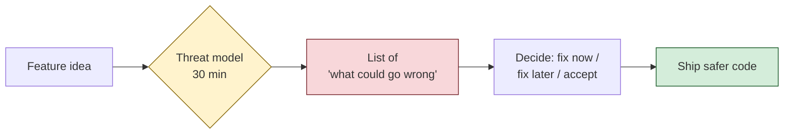

It's a **code review for abuse**, not for cleanliness.

### A real threat model is just a small table

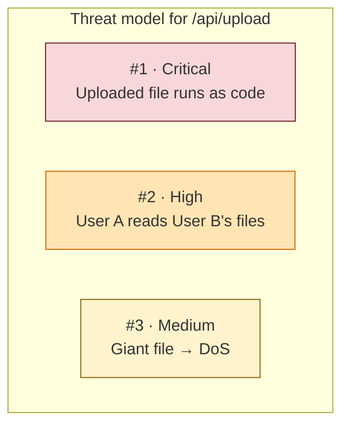

You don't have to *fix* everything — you have to **know it exists** so you can decide.

### Why devs skip it

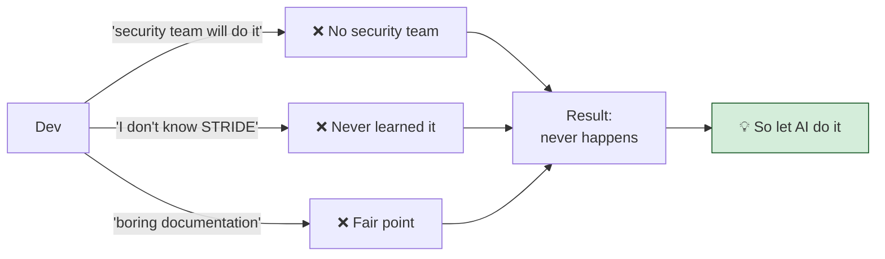

---

## Part 2 — STRIDE in One Diagram

STRIDE = **6 categories of things that can go wrong.** Memorize the letters, cover 80% of real bugs.

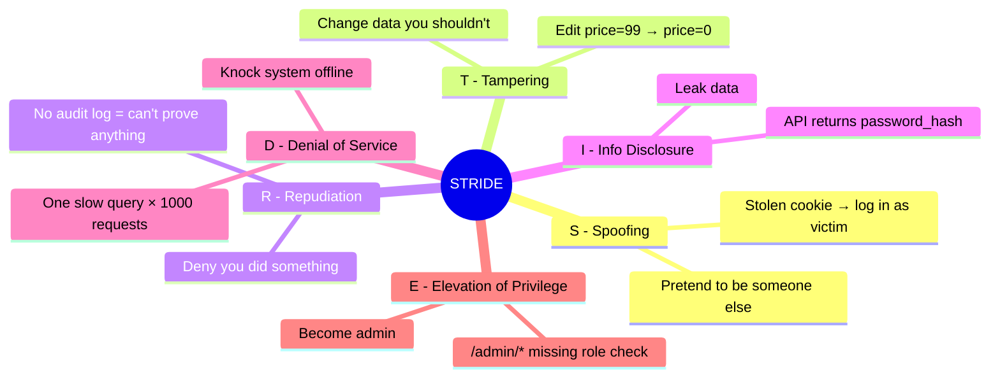

### How to use STRIDE in 30 seconds

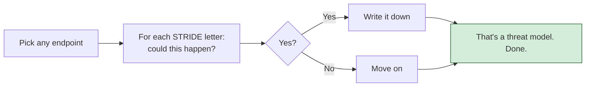

---

## Part 3 — MITRE ATT&CK: The Attacker's Playbook

If STRIDE is "what *categories* of bug exist," MITRE ATT&CK is **"what real attackers actually do, in order."**

Attackers don't find one bug and win — they **chain bugs**. MITRE catalogues every step.

```mermaid
flowchart LR
    A[Recon] --> B[Initial<br/>Access]
    B --> C[Execution]
    C --> D[Persistence]
    D --> E[Privilege<br/>Escalation]
    E --> F[Defense<br/>Evasion]
    F --> G[Credential<br/>Access]
    G --> H[Discovery]
    H --> I[Lateral<br/>Movement]
    I --> J[Collection]
    J --> K[Exfiltration]
    K --> L[Impact]

    style A fill:#e3f2fd
    style B fill:#bbdefb
    style E fill:#ffcdd2
    style I fill:#ffcdd2
    style K fill:#f8d7da,stroke:#721c24
    style L fill:#f8d7da,stroke:#721c24
```

### A real attack chain

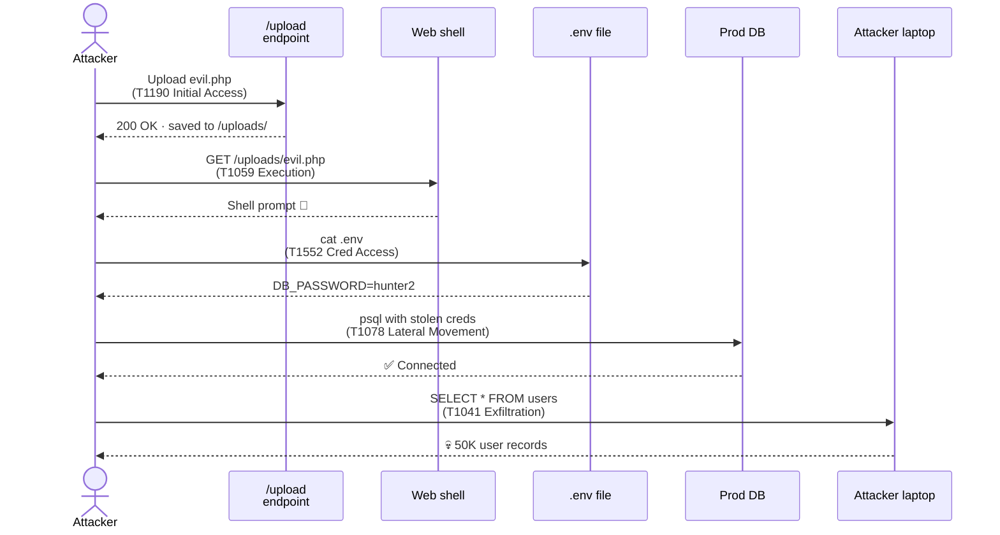

You don't memorize T-numbers. You internalize: **real attacks are graphs, not single bugs.**

### STRIDE vs MITRE — one picture

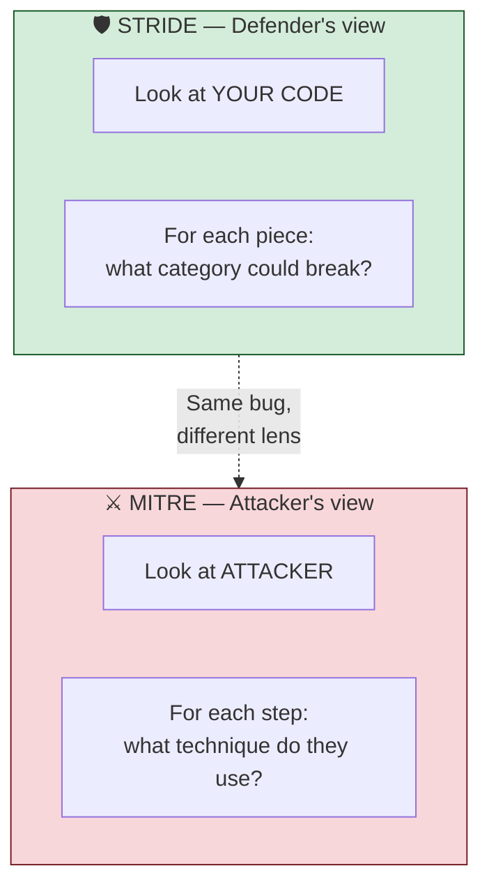

---

## Part 4 — How a Pentest Actually Works

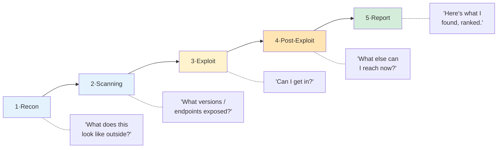

### Where the value actually is

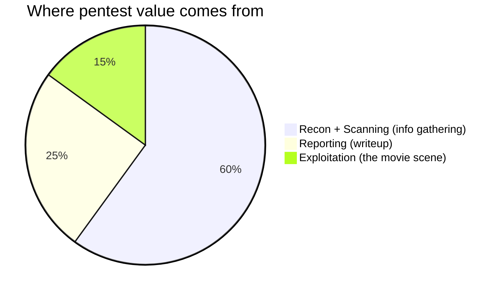

**90% of the work is information gathering + writeup.** That's exactly what LLMs are good at — which is why AI pentest tools exist.

---

## Part 5 — The AI Pentest Tool Landscape

Three tools devs will recognize the names of. Here's how they differ.

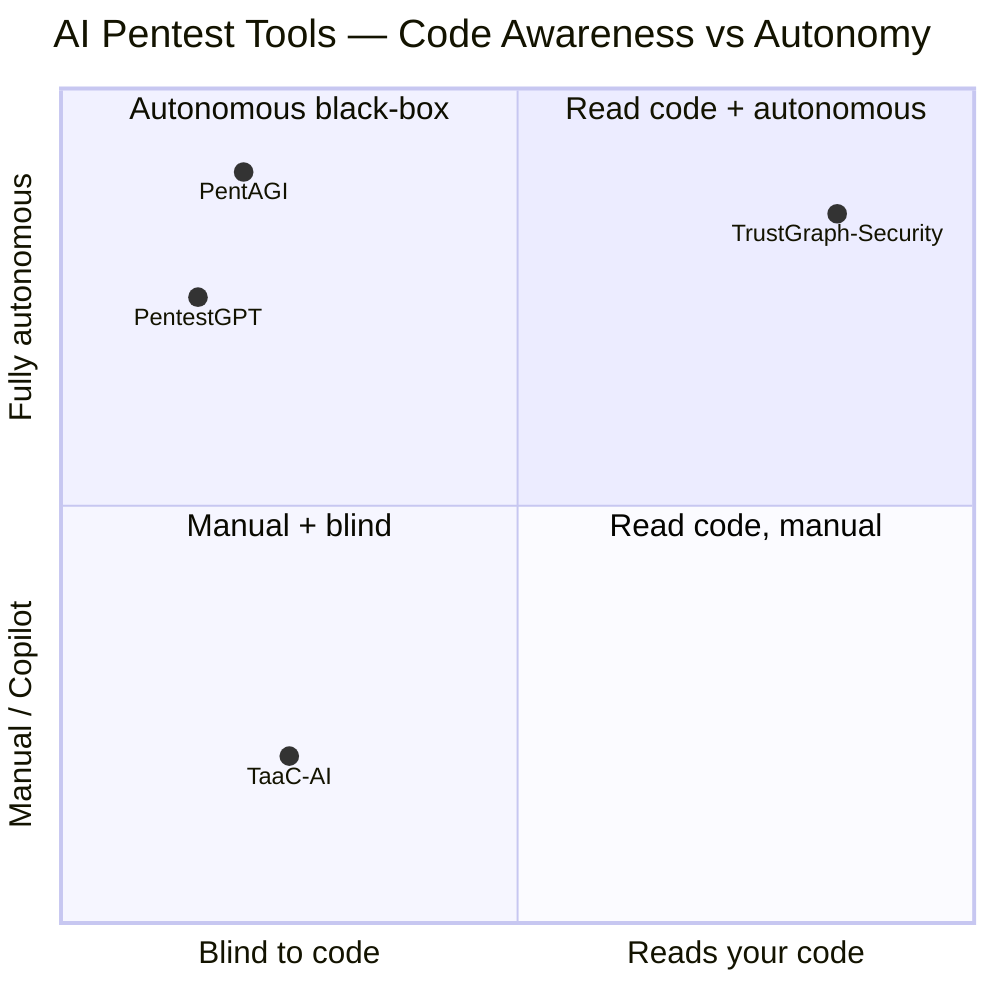

### TaaC-AI — Threat modeling as code

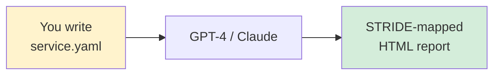

- ✅ Cheap, fast, language-agnostic
- ❌ You hand-write the YAML — it never sees your real code
- 🎯 Best for: design reviews before code exists
- 🔗 [yevh/TaaC-AI](https://github.com/yevh/TaaC-AI)

### PentestGPT — GPT as your pentest copilot

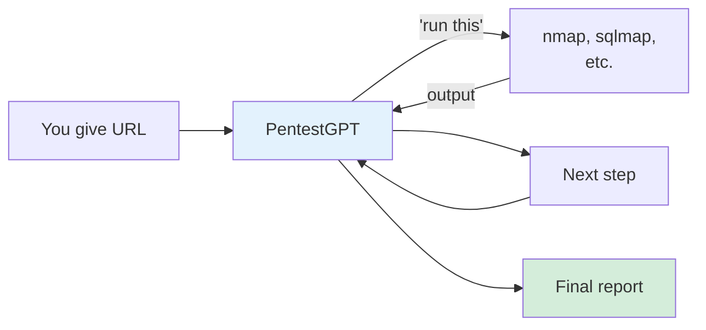

- ✅ ~90% solve rate on Hack The Box · mature (3 years) · now fully autonomous
- ❌ Black-box only — finds the bug, can't tell you the *line of code*
- ❌ Needs OpenAI API key with billing
- 🎯 Best for: you have a URL, you want to know if it's broken
- 🔗 [GreyDGL/PentestGPT](https://github.com/GreyDGL/PentestGPT)

### PentAGI — Autonomous pentester in a Docker sandbox

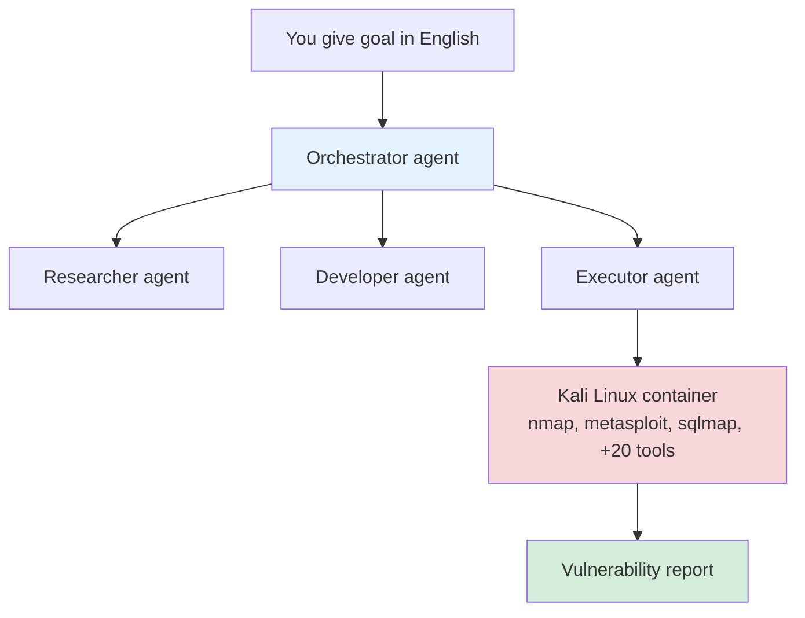

- ✅ Most autonomous · multi-LLM (OpenAI, Anthropic, Gemini, Ollama) · production observability
- ❌ Heavy stack (multiple containers, Postgres, vector DB) · still black-box
- 🎯 Best for: replacing a junior pentester for routine scans
- 🔗 [vxcontrol/pentagi](https://github.com/vxcontrol/pentagi)

### The comparison table

| Tool | Reads your code? | Black-box attacks? | Threat model? | Self-driving? | Devs can run it? |
|------|:---:|:---:|:---:|:---:|:---:|
| TaaC-AI | ❌ needs YAML | ❌ | ✅ STRIDE | ❌ | ✅ |
| PentestGPT | ❌ | ✅ | ❌ | ✅ | ⚠️ API key |
| PentAGI | ❌ | ✅ | ❌ | ✅ | ⚠️ heavy |
| **TrustGraph-Security** | ✅ **from repo** | ✅ via CAI | ✅ STRIDE+MITRE | ✅ | ✅ **one command** |

---

## Part 6 — So What Are We Building?

**TrustGraph-Security** is the missing column on that table.

> **"Point me at a GitHub repo. I'll read the code, build a security knowledge graph, rank the realistic attack paths, and run a live pentest against a deployed copy."**

### The pipeline

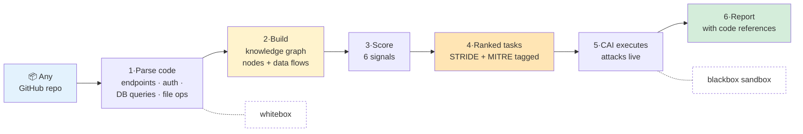

### Why this is different — whitebox + blackbox

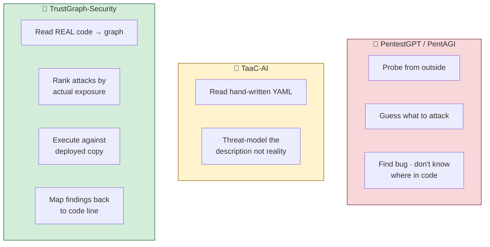

### The 6-signal scorer

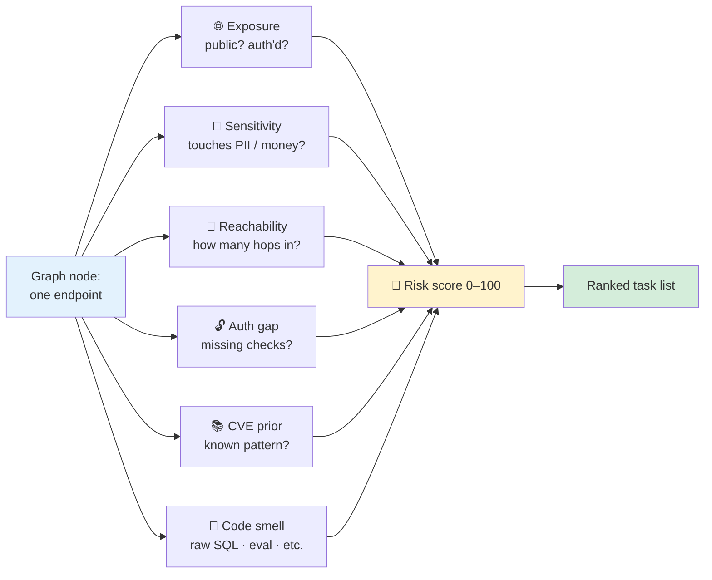

---

## Part 7 — What Happens Next

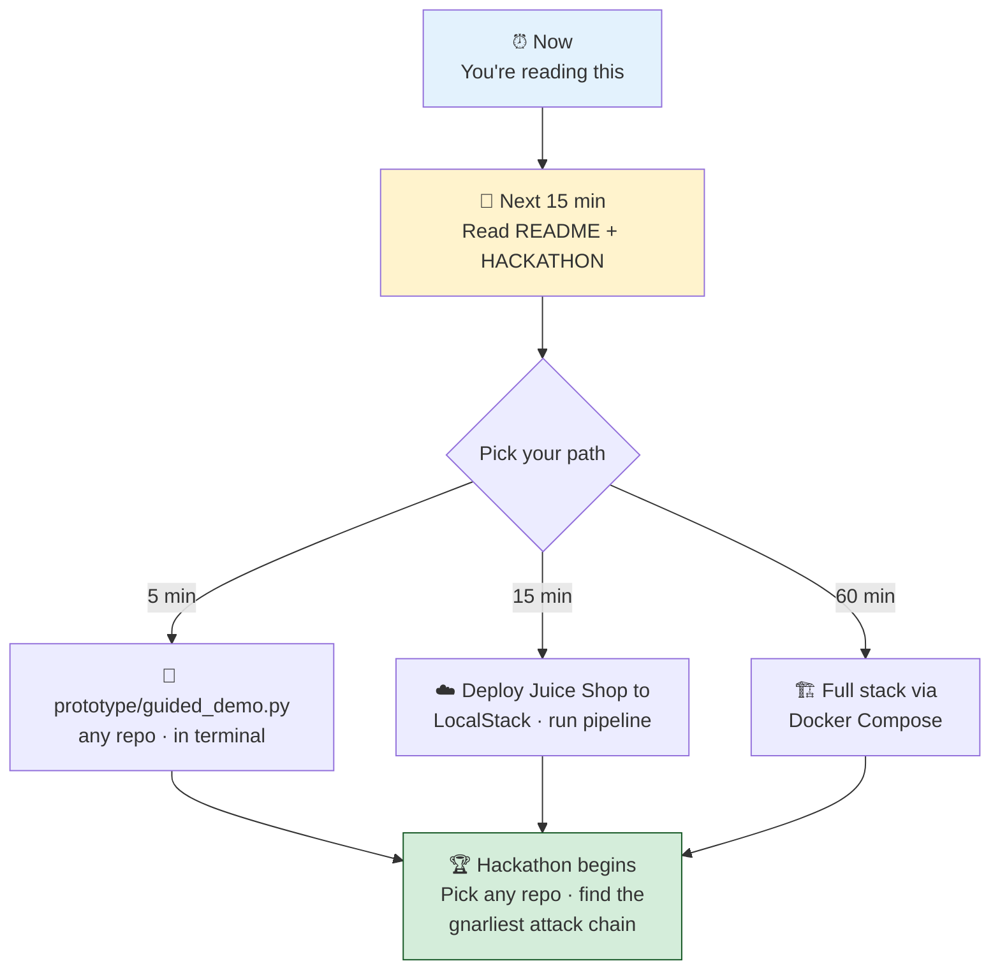

The graph and the tasks belong to you. The leaderboard is whoever finds the nastiest attack chain.

Welcome. Now read the rest of the room.

---

### Quick reference

- 🗺️ [Architecture diagram](./ARCHITECTURE.md)
- 📖 [Security concepts glossary](./CONCEPTS.md)
- 🚀 [5 / 15 / 60-min paths](./HACKATHON.md)
- 🎬 [Presenter walkthrough](./WALKTHROUGH.md)
- 🚢 [Full deployment](./DEPLOY.md)
