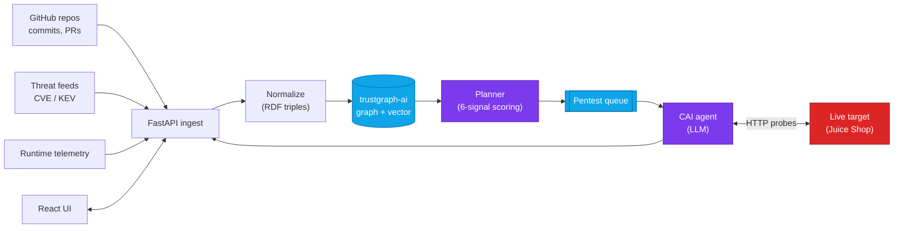

# TrustGraph Security

> **Read a GitHub repo → build a security knowledge graph → tell you what to attack first → let an AI agent attack it.**

Built for a hackathon audience with **zero security background**. Every step teaches the concept first, runs live, and lets you try it on your own repo.

[](https://www.terraform.io)
[](https://www.python.org)
[](https://fastapi.tiangolo.com)
[](https://docs.docker.com/compose)
[](https://localstack.cloud)

---

## 60-second tour

```bash
git clone https://github.com/DevOpsMadDog/trustgraph-security.git
cd trustgraph-security/prototype
pip install httpx
python guided_demo.py
```

You'll see:

1. A menu of repos to pick from (or paste your own GitHub URL).
2. **Four staged screens** — each opens with a plain-English concept box, then runs live and shows you the result.
3. A **ranked pentest task list** at the end — every task names a target, a STRIDE category, an objective, and the tools to use.

The whole thing runs on a laptop. No cloud account, no API key, no security background.

---

## Three things in this repo

### 1. `prototype/` — the interactive guided demo

500 lines of Python, runs against any GitHub repo. Shows the full pipeline:

```
GitHub URL → metadata → signals → RDF-shaped graph → ranked pentest tasks
```

Start here: **[`HACKATHON.md`](HACKATHON.md)** has the 5- / 15- / 60-minute paths.

### 2. `sandbox/juice-shop/` — Terraform + LocalStack + OWASP Juice Shop

Real ECS Fargate stack (19 AWS resources), deployed to LocalStack so it costs nothing and runs offline.

```bash
cd sandbox/juice-shop
make demo            # ~90s: LocalStack + Terraform + Juice Shop + first pentest
```

See: **[`sandbox/juice-shop/README.md`](sandbox/juice-shop/README.md)**

### 3. `apps/` — the production stack

Real FastAPI + Celery + [trustgraph-ai](https://github.com/trustgraph-ai/trustgraph) graph + [CAI](https://github.com/aliasrobotics/cai) autonomous pentester + React UI, all wired with Docker Compose.

```bash
make hackathon       # boots everything, seeds a demo target, runs first AI pentest
```

See: **[`DEPLOY.md`](DEPLOY.md)**

---

## Architecture at a glance



Full diagrams in **[`ARCHITECTURE.md`](ARCHITECTURE.md)**.

---

## How does this differ from Snyk / Semgrep / SonarQube?

| | Static scanners | TrustGraph Security |
|---|---|---|
| What they output | A flat list of findings | A **ranked** list of *what to attack first* |
| How they prioritize | Severity only | 6 signals × weights (severity, exposure, exploitability, control gap, churn, runtime alerts) |
| Combine static + runtime? | No | Yes — one knowledge graph |
| Prove the finding is real? | No | Yes — autonomous AI agent attacks the live target |
| Relationships first-class? | No | Yes — RDF graph in [trustgraph-ai](https://github.com/trustgraph-ai/trustgraph) |

---

## The 5 most common questions

| Question | Short answer |
|---|---|
| **Is an LLM picking what to attack?** | No. The planner is deterministic 6-signal math. The LLM (CAI) only *executes* tasks. |
| **Why STRIDE?** | Six buckets every threat fits: Spoofing, Tampering, Repudiation, Info-disclosure, DoS, Elevation. Industry-standard since the 90s. |
| **Why a graph, not a database table?** | Threats depend on relationships ("this endpoint is exposed AND has no rate limit AND lives in a money-handling service"). Graphs are first-class for that. |
| **Is this production-ready?** | The prototype is 500 lines, designed to teach. The full stack in `apps/` is the production version — same ontology, real scanners, real CAI integration. |
| **What if my repo has nothing to find?** | You'll still get repo-level checks (dependencies, Docker). It's a great control case. |

Full glossary in **[`CONCEPTS.md`](CONCEPTS.md)**.

---

## Repo map

```
trustgraph-security/
├── README.md             ← you are here
├── HACKATHON.md          ← presenter playbook + audience paths
├── CONCEPTS.md           ← plain-English security glossary
├── WALKTHROUGH.md        ← scripted live demo (what to click / say)
├── ARCHITECTURE.md       ← Mermaid diagrams (flowchart + sequence)
├── DEPLOY.md             ← full-stack deployment
│
├── prototype/            ← THE INTERACTIVE DEMO — start here
│   ├── guided_demo.py    ← run this
│   ├── repo_to_tasks.py  ← the pipeline (also usable from CLI/CI)
│   └── samples/          ← frozen reference artifacts
│
├── sandbox/juice-shop/   ← LocalStack ECS Fargate + Juice Shop
│   ├── docker-compose.localstack.yml
│   ├── terraform/        ← 19 AWS resources, validated
│   └── Makefile          ← make learn / compare / demo / up / down
│
├── apps/
│   ├── api/              ← FastAPI + Celery + trustgraph-ai client
│   ├── worker/           ← Celery worker + CAI subprocess wrapper
│   ├── ui/               ← React + Vite, JWT-aware, in-app explainers
│   └── demo_target/      ← intentionally vulnerable payments API
│
└── infra/
    ├── compose/          ← docker-compose.yml + sandbox overlay
    └── nginx/            ← reverse proxy for the React UI
```

---

## Status / known caveats

- Terraform stack is **`terraform validate`-clean** and produces a 19-resource plan against the AWS provider. End-to-end `terraform apply` against LocalStack is expected to work; verified on Linux/macOS with Docker.
- The CAI integration shells out to the `cai` CLI. Set `ANTHROPIC_API_KEY` (or `OPENAI_API_KEY` and `CAI_MODEL=openai/gpt-4o`) before running `make hackathon`.
- The Juice Shop container runs on `:3000` (sibling to LocalStack) so HTTP pentest tools have a real target to hit. The Terraform ECS resources model the *control plane*; the container models the *data plane*.

---

## License

[MIT](LICENSE) — go forth and hack.

## Credits

- [OWASP Juice Shop](https://owasp.org/www-project-juice-shop/) — the canonical vulnerable web app
- [trustgraph-ai](https://github.com/trustgraph-ai/trustgraph) — the graph + retrieval substrate
- [CAI Cybersecurity AI](https://github.com/aliasrobotics/cai) — autonomous LLM pentest agent
- [LocalStack](https://localstack.cloud) — AWS emulation for free
- The Medium article by [Bharath](https://medium.com/@bharath181994/create-and-run-web-app-on-ecs-using-aws-fargate-3199551c6c1b) that inspired the Juice Shop ECS Fargate pattern
